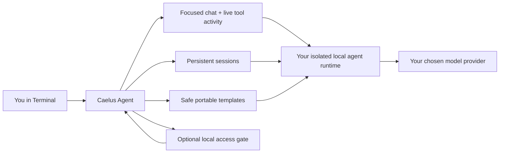

<div align="center">
  

# Caelus Agent

### Your private, local-first AI command center for macOS.

**A focused terminal experience for running capable agents, keeping conversations persistent, and watching real work happen—without turning your workflow into a dashboard maze.**

[Quick install](#quick-install) · [What it does](#what-you-get) · [Commands](#command-reference) · [Safety](#privacy-and-safety) · [Technical reference](#technical-reference)
</div>

---

## Quick install

**Paste this one line into Terminal on macOS:**

```bash
curl -fsSL https://raw.githubusercontent.com/ashermenachem/caelus-agent/v0.1.8/scripts/install-macos.sh | bash
```

The installer checks for a supported Python first. If it is missing or too old, it installs Homebrew using Homebrew’s official installer, then installs Python 3.11 and continues automatically. macOS may ask the user for an administrator password during Homebrew setup; Caelus never sees, stores, or transmits that password.

It then installs the `caelus` command, creates a dedicated local workspace at `~/.caelus`, asks the user to set an optional local access password, offers provider setup, and can start Caelus immediately. It never copies an existing agent profile, conversations, credentials, or browser state.

> **No unnecessary developer tools:** Caelus does not install Xcode because it is not required to run the app. It installs only a supported Python when needed.

### Remove Caelus completely

To remove **all Caelus-owned local files**—its isolated runtime, agent setup, local access gate, session data, logs, virtual environment, and the `caelus` launcher—paste this single command:

```bash
curl -fsSL https://raw.githubusercontent.com/ashermenachem/caelus-agent/v0.1.8/scripts/uninstall-macos.sh | bash
```

This is irreversible. It removes only `~/.caelus` and the `~/.local/bin/caelus` launcher when that launcher belongs to Caelus. It intentionally does **not** delete system-wide Python, Homebrew, or a separately used shared agent runtime.

---

## What you get

Caelus Agent is built for people who want an AI operator that feels immediate, readable, and under their control.

- **A clean command-center terminal** — focused chat, session context, skills, available tools, and live activity in one screen.
- **Real work you can see** — stream responses and tool progress instead of staring at a spinner and hoping.
- **Persistent conversations** — resume a session and pick up exactly where you left off.
- **One-key interruption** — press `Ctrl-C` while work is running to request cancellation.
- **Private by default** — your Caelus workspace is separate from other local agent profiles.
- **Portable agent templates** — share reusable behavior without packaging secrets, memories, logs, or personal history.
- **Local access gate** — optionally require a hidden password before Caelus runs.
- **A real release path** — tested wheel builds, isolated installer validation, and CI-backed release verification.
- **Caelus Replay** — teach a bounded, read-only browser workflow once, preview it, then run it with a durable receipt.

### The Caelus flow



Caelus is not another bloated control panel. It is the fast, calm layer between you and capable local agent workflows.

---

## Start here

| Goal | Command |
| --- | --- |
| Open Caelus | `caelus` |
| Start the local runtime | `caelus runtime start` |
| Check whether it is healthy | `caelus runtime status` |
| Stop it | `caelus runtime stop` |
| See the interface without connecting a model | `caelus --demo` |
| Set a local access password | `caelus gate set` |

### Your first session

```bash
caelus runtime start
caelus
```

Use `/help` inside a session for Caelus controls. Use `/quit` or `/exit` when you are done.

---

## Command reference

### Runtime

```bash
caelus runtime init                         # create or repair the isolated runtime
caelus runtime start                        # start its local API service
caelus runtime status                       # show process and API health
caelus runtime stop                         # stop only Caelus's local service
```

### Sessions and chat

```bash
caelus --demo                               # render a no-credential product demo
caelus --interactive --endpoint URL --api-key KEY
caelus --chat "Summarize this" --endpoint URL --api-key KEY
caelus --interactive --session-id SESSION_ID --endpoint URL --api-key KEY
```

Interactive mode streams structured activity and keeps the session available for later resume. Press `Ctrl-C` during an active run to request cancellation.

### Local access gate

```bash
caelus gate set                             # hidden password setup or change
caelus gate status                          # see whether a gate is configured
```

The gate permits three hidden attempts per command launch and stores a salted verifier—not a plaintext password.

### Portable agent templates

```bash
caelus template export \
  --source ./generic-research-agent \
  --output ./research.caelus-template

caelus template import \
  --input ./research.caelus-template \
  --destination ./my-research-agent
```

Templates contain portable behavior only: generic instructions, selected tool preferences, and Markdown skills. They reject credentials, `.env` files, memory, session databases, logs, contacts, browser data, symlinks, and machine-specific state.

### Caelus Replay — teach it once, run it safely

Replay v0 turns a manually described browser workflow into a narrow, durable recipe. It is deliberately **not** a universal macro recorder or a blind self-healing agent.

```bash
caelus replay teach daily-assignments \
  --domain portal.example.edu \
  --step "Open the assignments page" \
  --step "Read assignments due this week" \
  --verify "The current assignment list is visible"

caelus replay preview daily-assignments

caelus replay run daily-assignments
```

Recipes are saved privately under `~/.caelus/replays/`. Each run creates a receipt with the runtime outcome, observed tool activity, and the verification condition that still must be proven. Replay v0 is **read-only**: it instructs the runtime not to submit forms, send messages, purchase, delete, publish, change settings, or handle secrets. If the expected page state differs, the agent must stop and report the mismatch rather than claim success.

---

## Privacy and safety

- Caelus creates and uses `~/.caelus/runtime`; it does **not** silently reuse an existing `~/.hermes` profile.
- No personal memory, sessions, credentials, workflow history, or browser state are included in templates or release artifacts.
- The access gate is a **local deterrent**, not server-side invite-only authentication. Anyone with access to the same macOS account or installed source can bypass it.
- Replay recipes never store passwords, tokens, cookies, or browser state. They are restricted to explicitly allowed hostnames and read-only behavior in v0.
- Caelus uses [Hermes Agent](https://github.com/NousResearch/hermes-agent) as a separate local runtime dependency. Its attribution and license information are preserved in [NOTICE](NOTICE).

---

## Technical reference

### Install details

The installer supports macOS and Python 3.9+. It creates:

```text
~/.caelus/
├── runtime/                 # dedicated local runtime and private API key
└── venv/                    # Caelus installation environment

~/.local/bin/caelus          # command-line launcher
```

If `~/.local/bin` is not already on your shell `PATH`, reopen Terminal after installation or add it to your shell profile.

For controlled installs, use:

```bash
CAELUS_HOME=/custom/caelus CAELUS_BIN_DIR=/custom/bin bash scripts/install-macos.sh
```

### Verification and contributors

```bash
PYTHON="$PWD/.venv/bin/python" bash scripts/release-check.sh
```

The release check runs the full suite, builds the distributable wheel, verifies the legal files and shipped modules, tests a fresh wheel install, and tests the macOS installer in isolated temporary paths. GitHub Actions runs the same gate on pull requests and updates to `main`.

See [CHANGELOG.md](CHANGELOG.md) for version history, [LICENSE](LICENSE) for the proprietary Caelus Agent terms, and [NOTICE](NOTICE) for third-party attribution.

### Licensing note

Caelus Agent releases starting with `v0.1.5` are proprietary and all rights are reserved. Earlier public releases were published under MIT; those earlier grants are not retroactively revoked. This repository remains public for installation and evaluation, not for reuse or redistribution.
